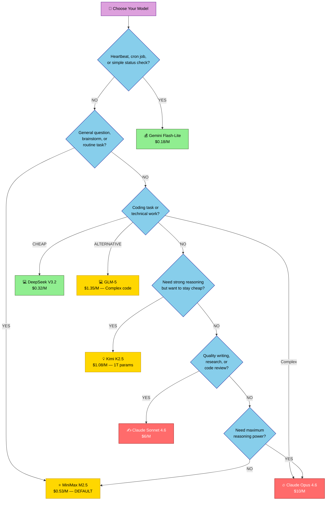

# OpenClaw Cost Optimization Guide

# 🔥 Cut Your OpenClaw API Bill by 70-97%

## The Complete Cost Optimization Guide for Hostinger VPS

You’re running OpenClaw on a Hostinger VPS with Docker and OpenRouter. Smart move. But here’s the thing: if you haven’t optimized your model routing and context usage, you’re probably paying 5-10x more than you should be. This guide will walk you through the exact steps to cut your API costs by 70-97% without sacrificing quality.

The good news? Most of this is configuration. No code changes, no complex workarounds. Just smarter routing, leaner prompts, and strategic use of caching.

---

## 📊 Where Your Money Actually Goes (The 6 Cost Drivers)

Before you optimize, you need to understand what’s eating your budget. Here are the six hidden cost drivers in OpenClaw:

| Cost Driver | Impact | Why It Matters |
| --- | --- | --- |
| **Wrong default model** | 40-70% of bill | Using Claude Opus for everything when MiniMax works fine |
| **Constant heartbeats hitting paid models** | 15-30% of bill | Heartbeats should route to cheapest models, not your daily driver |
| **Bloated context windows** | 20-50% of bill | 136K base token overhead (system prompt + tool schemas) × every request |
| **No prompt caching** | 10-40% of bill | Repeat queries get charged full price instead of 90% discount |
| **Session bloat** | 10-30% of bill | Long sessions accumulate context; resets save 40-60% per question |
| **Inefficient tool usage** | 5-20% of bill | Tools that return verbose output waste tokens |

The dirty secret: **136K tokens of base overhead is unavoidable** — that’s your system prompt + tool schemas. You can’t eliminate it, but you can make it count by reducing per-request waste around it.

---

## Quick-Start Setup (Get Running in 10 Minutes)

### Follow This Simple Simple 5 Minute Setup (Recommended)

[Simple OpenClaw Setup in 10 Minutes](https://www.notion.so/Simple-OpenClaw-Setup-in-10-Minutes-3123410da2638090b8f2dcc92b77c93c?pvs=21)

Setup your Private VPS with Clawdbot in 10 minutes:

[OpenClaw VPS Hosting | One-Click AI Assistant Setup](https://www.hostinger.com/moe-lueker)

Optional: Use code  ***MOE-LUEKER***  for a discount

Set Up OpenRouter:

## Set Up OpenRouter to get access to all AI models with 1 API:

[OpenRouter <> OpenClaw Setup](https://www.notion.so/OpenRouter-OpenClaw-Setup-3123410da26380968aacdd8b2dcd85c3?pvs=21)

## 💰 The 2026 Model Pricing Cheat Sheet

Here’s the current pricing landscape as of February 24, 2026 (all prices per 1M tokens, via OpenRouter):

### 🟢 Budget Tier — The Workhorse Candidates

These are the models you should be using for 80%+ of your daily tasks:

| Model | Input | Output | Blended* | Context | OpenRouter Slug |
| --- | --- | --- | --- | --- | --- |
| **GPT-5 Nano** | $0.05 | $0.40 | $0.14 | 128K | `openrouter/openai/gpt-5-nano` |
| **Gemini 2.5 Flash-Lite** | $0.10 | $0.40 | $0.18 | 1M | `openrouter/google/gemini-2.5-flash-lite` |
| **DeepSeek V3.2** | $0.28 | $0.40 | $0.31 | 164K | `openrouter/deepseek/deepseek-v3.2` |
| **MiniMax M2.5** | $0.30 | $1.20 | $0.53 | 205K | `openrouter/minimax/minimax-m2.5` |
| **Kimi K2.5** | $0.50 | $2.80 | $1.08 | 262K | `openrouter/moonshotai/kimi-k2.5` |
| **GPT-5 Mini** | $0.25 | $2.00 | $0.69 | 128K | `openrouter/openai/gpt-5-mini` |
| **Gemini 2.5 Flash** | $0.30 | $2.50 | $0.85 | 1M | `openrouter/google/gemini-2.5-flash` |
| **GLM-5** | $0.95 | $2.55 | $1.35 | 205K | `openrouter/z-ai/glm-5` |
- *Blended = weighted average at 3:1 input-to-output ratio (typical for chat)*

### 🟡 Mid Tier — Quality When You Need It

| Model | Input | Output | Blended* | Context | OpenRouter Slug |
| --- | --- | --- | --- | --- | --- |
| **Claude Haiku 4.5** | $1.00 | $5.00 | $2.00 | 200K | `openrouter/anthropic/claude-haiku-4-5` |
| **Claude Sonnet 4.6** | $3.00 | $15.00 | $6.00 | 1M | `openrouter/anthropic/claude-sonnet-4-6` |

### 🔴 Premium Tier — Use Sparingly

| Model | Input | Output | Blended* | Context | OpenRouter Slug |
| --- | --- | --- | --- | --- | --- |
| **Claude Opus 4.6** | $5.00 | $25.00 | $10.00 | 1M | `openrouter/anthropic/claude-opus-4-6` |
| **GPT-5** | $1.25 | $10.00 | $3.44 | 400K | `openrouter/openai/gpt-5` |

### 🏆 The Workhorse Verdict: Which Budget Model Should You Pick?

Here’s the honest breakdown of the budget tier:

| Model | Strengths | Weaknesses | Best As |
| --- | --- | --- | --- |
| **GPT-5 Nano** ($0.14 blended) | Absolute cheapest from a major provider | Limited reasoning, small context | Heartbeats, simple classification |
| **Gemini Flash-Lite** ($0.18 blended) | Nearly as cheap, 1M context window | Less capable on complex tasks | Heartbeats, status checks, cron jobs |
| **DeepSeek V3.2** ($0.31 blended) | Frontier-quality at budget price, great coding, IMO gold-medal reasoning | Chinese provider (data concerns for some), 164K context | Budget daily driver for coding |
| **MiniMax M2.5** ($0.53 blended) | Excellent general quality, 205K context, MIT license, strong agentic performance, #1 most-used on OpenRouter | Slightly higher output cost | **← RECOMMENDED daily driver** |
| **Kimi K2.5** ($1.08 blended) | 1T params, strong visual coding, auto-caching drops input to $0.13, 262K context | Higher base price, newer/less tested | Complex reasoning + multimodal on a budget |
| **GLM-5** ($1.35 blended) | 77.8% SWE-bench, strong coding, open-source, 205K context | Pricier than MiniMax/DeepSeek | Coding-heavy workflows |

> **💡 Our recommendation:** **MiniMax M2.5 as your primary daily driver.** It hits the sweet spot between cost ($0.53/M blended) and capability — strong enough for 80% of tasks, with a 1M context window. Use Gemini Flash-Lite ($0.18/M) for heartbeats and simple checks. Escalate to Sonnet 4.6 ($6/M) only when quality matters.
> 
> 
> If you’re heavily code-focused, DeepSeek V3.2 ($0.32/M) is even cheaper and matches frontier models on coding benchmarks. GLM-5 and Kimi K2.5 are excellent alternatives if MiniMax doesn’t click for your use case.
> 

### Key Pricing Updates (February 2026)

- **Claude Opus price drop:** Opus 4.6 went from $15/$75 to $5/$25 — a 67% cut. Still expensive for daily use, but reasonable for critical tasks.
- **Claude Sonnet 4.6** (released Feb 17, 2026): Nearly matches Opus performance at $3/$15. The new sweet spot for quality work.
- **MiniMax M2.5** (released Feb 12, 2026): 230B total params (10B active), MIT license, $0.30/$1.20. Described as “the first frontier model where users don’t need to worry about cost.”
- **GLM-5** (released Feb 11, 2026): Z.ai’s flagship, 744B MoE with 40B active. $0.95/$2.55 on OpenRouter. 77.8% SWE-bench Verified.
- **Kimi K2.5** (released Jan 27, 2026): Moonshot AI’s 1T param MoE with 32B active. $0.50/$2.80 on OpenRouter. Built-in context caching drops repeat input costs by 75%.
- **DeepSeek V4** expected mid-Feb 2026, likely similar pricing to V3.2.

**For your Hostinger setup:** You have one OpenRouter API key. All these models are available through it. No local LLMs needed.

---

## 🆕 Using GLM-5 and Kimi K2.5 via OpenRouter

These two models are recent additions that punch way above their price class. Here’s how to get them working on your OpenClaw Hostinger setup.

### GLM-5 (Z.ai) — The Coding Specialist

GLM-5 dropped on February 11, 2026 and immediately made waves. It’s a 744B MoE model (40B active parameters) built for complex systems design and long-horizon agent workflows. On SWE-bench Verified it scores 77.8% — putting it in frontier territory for coding tasks.

**Why you’d use it:** If you’re asking OpenClaw to write code, debug systems, or do backend architecture work, GLM-5 is a strong alternative to Claude Sonnet at roughly 1/4 the price.

**OpenRouter slug:** `openrouter/z-ai/glm-5`

**Add it via chat (recommended):**

Just copy-paste this message into your OpenClaw chat:

```
Please add GLM-5 to my available models via OpenRouter. The slug is openrouter/z-ai/glm-5 with alias "glm". It has a 205K context window.
```

Then you can switch in chat with `/model glm`.

**📁 Manual Alternative: Edit the Config File Directly**

If the chat method didn’t work, add this to your config manually.

In the `models.providers.openrouter.models` array, add:

```json
{
  "id": "z-ai/glm-5",
  "name": "GLM-5",
  "contextWindow": 205000,
  "maxTokens": 8192
}
```

In your `agents.defaults.models`, add:

```json
"openrouter/z-ai/glm-5": { "alias": "glm" }
```

> **💡 Pro tip:** GLM-5 is particularly strong at iterative self-correction. If you give it a bug, it’ll often fix it in one pass. For simpler coding tasks, DeepSeek V3.2 is cheaper ($0.31/M vs. $1.35/M blended) — use GLM-5 when the task is genuinely complex.
> 

---

### Kimi K2.5 (Moonshot AI) — The Reasoning + Multimodal Powerhouse

Kimi K2.5 launched January 27, 2026. It’s a massive 1T parameter MoE model (32B active) with native multimodal support — it can read images, generate visual code, and reason about UI screenshots.

**The killer feature: auto-caching.** Kimi K2.5 has built-in context caching that drops repeat input costs from $0.50/M to $0.13/M — a 75% discount on cached tokens. If you’re running repeated tasks with similar system prompts (which OpenClaw does constantly), this is huge.

**Why you’d use it:** Complex reasoning tasks where you want frontier quality but can’t justify Sonnet/Opus pricing. Also great for anything involving images or UI analysis.

**OpenRouter slug:** `openrouter/moonshotai/kimi-k2.5`

**Add it via chat (recommended):**

Just copy-paste this message into your OpenClaw chat:

```
Please add Kimi K2.5 to my available models via OpenRouter. The slug is openrouter/moonshotai/kimi-k2.5 with alias "kimi". It has a 262K context window.
```

Then you can switch in chat with `/model kimi`.

**📁 Manual Alternative: Edit the Config File Directly**

If the chat method didn’t work, add this to your config manually.

In the `models.providers.openrouter.models` array, add:

```json
{
  "id": "moonshotai/kimi-k2.5",
  "name": "Kimi K2.5",
  "contextWindow": 262000,
  "maxTokens": 8192
}
```

In your `agents.defaults.models`, add:

```json
"openrouter/moonshotai/kimi-k2.5": { "alias": "kimi" }
```

> **💡 Pro tip:** Kimi K2.5’s auto-caching means it gets cheaper the more you use it within a session. For multi-turn research tasks, it can end up costing less than MiniMax on input tokens after the first few messages.
> 

---

## 📐 Deep Price Analysis: The Math Behind the Workhorse Decision

Let’s do the actual math. This isn’t hand-waving — it’s real token counts × real prices.

### What a “Typical OpenClaw Request” Actually Costs

Every OpenClaw request has a fixed overhead: the system prompt, tool schemas, and context injection total roughly **140K input tokens**. On top of that, your actual message and the model’s response add variable tokens.

Here’s what each model costs for different request types:

### Cost Per Single Request (140K base + variable)

| Model | Simple Q (142K in, 50 out) | Medium Task (150K in, 500 out) | Complex Task (165K in, 2K out) | Research (200K in, 3K out) |
| --- | --- | --- | --- | --- |
| **GPT-5 Nano** | $0.007 + $0.00002 = **$0.007** | $0.008 + $0.0002 = **$0.008** | $0.008 + $0.001 = **$0.009** | $0.010 + $0.001 = **$0.011** |
| **Gemini Flash-Lite** | $0.014 + $0.00002 = **$0.014** | $0.015 + $0.0002 = **$0.015** | $0.017 + $0.001 = **$0.017** | $0.020 + $0.001 = **$0.021** |
| **DeepSeek V3.2** | $0.040 + $0.00002 = **$0.040** | $0.042 + $0.0002 = **$0.042** | $0.046 + $0.001 = **$0.047** | $0.056 + $0.001 = **$0.057** |
| **MiniMax M2.5** | $0.043 + $0.00006 = **$0.043** | $0.045 + $0.001 = **$0.046** | $0.050 + $0.002 = **$0.052** | $0.060 + $0.004 = **$0.064** |
| **Kimi K2.5** | $0.071 + $0.0001 = **$0.071** | $0.075 + $0.001 = **$0.076** | $0.083 + $0.006 = **$0.088** | $0.100 + $0.008 = **$0.108** |
| **Kimi K2.5 (cached)** | $0.018 + $0.0001 = **$0.019** | $0.020 + $0.001 = **$0.021** | $0.021 + $0.006 = **$0.027** | $0.026 + $0.008 = **$0.034** |
| **GLM-5** | $0.135 + $0.0001 = **$0.135** | $0.143 + $0.001 = **$0.144** | $0.157 + $0.005 = **$0.162** | $0.190 + $0.008 = **$0.198** |
| **Claude Haiku 4.5** | $0.142 + $0.0003 = **$0.142** | $0.150 + $0.003 = **$0.153** | $0.165 + $0.010 = **$0.175** | $0.200 + $0.015 = **$0.215** |
| **Claude Sonnet 4.6** | $0.426 + $0.001 = **$0.427** | $0.450 + $0.008 = **$0.458** | $0.495 + $0.030 = **$0.525** | $0.600 + $0.045 = **$0.645** |
| **Claude Opus 4.6** | $0.710 + $0.001 = **$0.711** | $0.750 + $0.013 = **$0.763** | $0.825 + $0.050 = **$0.875** | $1.000 + $0.075 = **$1.075** |

> The key insight: **Input tokens dominate cost** because of OpenClaw’s 140K base overhead. Output tokens barely matter for simple questions. This is why switching models saves so much — the 140K base overhead costs $0.71 on Opus vs. $0.04 on MiniMax.
> 

---

### Cost Per Day: 50 Mixed Questions

Breakdown: 35 simple + 12 medium + 3 complex tasks, plus heartbeats

| Model as Default | Daily Q Cost | Daily Heartbeats (26/day) | **Daily Total** | **Monthly** |
| --- | --- | --- | --- | --- |
| **Claude Opus 4.6** | $36.07 | $18.49 | **$54.56** | **$1,636.80** |
| **Claude Sonnet 4.6** | $16.15 | $11.10 | **$27.25** | **$817.50** |
| **Claude Haiku 4.5** | $5.42 | $3.70 | **$9.12** | **$273.60** |
| **GLM-5** | $5.20 | $3.51 | **$8.71** | **$261.30** |
| **Kimi K2.5** | $2.80 | $1.85 | **$4.65** | **$139.50** |
| **Kimi K2.5 (cached)** | $0.77 | $0.49 | **$1.26** | **$37.80** |
| **MiniMax M2.5** | $1.67 | $1.12 | **$2.79** | **$83.70** |
| **DeepSeek V3.2** | $1.56 | $1.04 | **$2.60** | **$78.00** |
| **Gemini Flash-Lite** | $0.55 | $0.37 | **$0.92** | **$27.60** |
| **GPT-5 Nano** | $0.27 | $0.18 | **$0.45** | **$13.50** |

Now here’s the same table **with optimized heartbeats on Flash-Lite** (instead of default model):

| Model as Default | Daily Q Cost | Heartbeats (Flash-Lite) | **Daily Total** | **Monthly** | **vs. Opus Default** |
| --- | --- | --- | --- | --- | --- |
| **Claude Opus 4.6** | $36.07 | $0.36 | **$36.43** | **$1,092.90** | 0% |
| **Claude Sonnet 4.6** | $16.15 | $0.36 | **$16.51** | **$495.30** | -70% |
| **GLM-5** | $5.20 | $0.36 | **$5.56** | **$166.80** | -90% |
| **Kimi K2.5** | $2.80 | $0.36 | **$3.16** | **$94.80** | -94% |
| **MiniMax M2.5** | $1.67 | $0.36 | **$2.03** | **$60.90** | **-96%** |
| **DeepSeek V3.2** | $1.56 | $0.36 | **$1.92** | **$57.60** | **-96%** |
| **Gemini Flash-Lite** | $0.55 | $0.36 | **$0.91** | **$27.30** | -98% |

---

### 🏆 The Workhorse Verdict (With Numbers)

Looking at cost, quality, and practical usability for OpenClaw:

| Rank | Model | Monthly Cost (Active User) | Quality | Context | The Verdict |
| --- | --- | --- | --- | --- | --- |
| 🥇 | **MiniMax M2.5** | $60.90 | Frontier-class, #1 on OpenRouter usage | 205K | **Best all-rounder. Strong enough for 80% of tasks, cheap enough to not care.** |
| 🥈 | **DeepSeek V3.2** | $57.60 | GPT-5 class, IMO gold-medal reasoning | 164K | **Cheapest frontier model. Best for coding-heavy users. $3/mo cheaper than MiniMax.** |
| 🥉 | **Kimi K2.5 (cached)** | $37.80 | 1T params, strong reasoning + multimodal | 262K | **Dark horse. Auto-caching makes it dirt cheap after warmup. Best if you do long sessions.** |
| 4 | **Gemini Flash-Lite** | $27.30 | Good for simple tasks, weak on complex | 1M | **Too weak for daily driver. Perfect for heartbeats + cron jobs.** |
| 5 | **GLM-5** | $166.80 | Frontier coding, 77.8% SWE-bench | 205K | **Expensive for daily use. Best as a `/model glm` escalation for tough coding tasks.** |

> **Final recommendation:** **MiniMax M2.5 as your primary with Flash-Lite for heartbeats.** This gets you to ~$61/month for active usage (50 questions/day). If you want to save another $3/month, switch to DeepSeek V3.2 — the quality is comparable but the context window is smaller (164K vs. 205K).
> 
> 
> Use `/model kimi` for reasoning tasks, `/model glm` for hard coding problems, and `/model sonnet` when you truly need Claude quality. Keep `/model opus` for the 1-2 times per week you need nuclear-grade intelligence.
> 

---

## 🔐 Step 0: Set Up Your OpenRouter API Key (Do This First)

Before you can use any models, you need to connect your OpenRouter API key to OpenClaw. The safest way is through the dashboard, not by pasting it in chat.

### Add Your API Key Through the Dashboard

1. Go to **openrouter.ai** → **Dashboard** → **Keys** → **Create New Key** → **Copy it**
2. In your **OpenClaw Gateway Dashboard**, go to **Settings → Config → Environment**
3. In the **Vars** section, click **+ Add Entry**
4. Set the key name to `OPENROUTER_API_KEY` and paste your key as the value
5. Click **Save**, then **Apply**

> **Why this is safer:** Adding your API key through the Environment Variables section encrypts it in your config. Chat messages may be logged in session history, which is less secure. Environment variables stay private.
> 

### Register the Auth Profile

Now tell your OpenClaw agent to register the token. Copy-paste this into your OpenClaw chat:

```
Please run: openclaw models auth paste-token --provider openrouter

Use the OPENROUTER_API_KEY from my environment variables. No expiry needed.
```

The agent will register the token. If that doesn’t work (known issue on some installs), you can create it manually via SSH:

```bash
docker exec -it YOUR_CONTAINER_NAME sh -c 'cat > /data/.openclaw/agents/main/agent/auth-profiles.json << EOF
{
  "version": 1,
  "profiles": {
    "openrouter:manual": {
      "provider": "openrouter",
      "type": "api_key",
      "apiKey": "YOUR_OPENROUTER_API_KEY"
    }
  }
}
EOF'
```

### Verify It Worked

In chat, try:

```
/model haiku
What time is it?
```

If you get a response, you’re good. If you get `NO_REPLY`, the auth profile path is wrong — check the path is `/data/.openclaw/agents/main/agent/auth-profiles.json`.

---

## 🚀 Step 1: Switch Your Default Model (The Single Biggest Win)

Your default model routing is costing you 40-70% of your bill. Here’s why: if you set Claude Opus as your default, **every request** — even simple checks — hits that $1 input cost.

### The Smart Default Strategy

- **Daily driver (80% of requests):** MiniMax M2.5 ($0.30/$1.20) or DeepSeek V3.2 ($0.28/$0.42)
- **Quality work (15% of requests):** Claude Sonnet 4.6 ($3.00/$15.00)
- **Complex reasoning (5% of requests):** Claude Opus 4.6 ($5.00/$25.00)

MiniMax M2.5 is proven in production. It’s fast, accurate for general tasks, and costs 1/17th of Opus.

### Primary Method: Ask Your Agent in Chat

Just copy-paste this into your OpenClaw chat:

```
I want to optimize my model configuration for cost savings. Please make these changes:

1. Set my primary model to openrouter/minimax/minimax-m2.5
2. Set fallbacks to: openrouter/anthropic/claude-haiku-4-5, then openrouter/google/gemini-2.5-flash
3. Add these model aliases:
   - "minimax" → openrouter/minimax/minimax-m2.5
   - "deepseek" → openrouter/deepseek/deepseek-v3.2
   - "kimi" → openrouter/moonshotai/kimi-k2.5
   - "glm" → openrouter/z-ai/glm-5
   - "flashlite" → openrouter/google/gemini-2.5-flash-lite
   - "flash" → openrouter/google/gemini-2.5-flash
   - "haiku" → openrouter/anthropic/claude-haiku-4-5
   - "sonnet" → openrouter/anthropic/claude-sonnet-4-6
   - "opus" → openrouter/anthropic/claude-opus-4-6
   - "gpt" → openrouter/openai/gpt-5-mini
   - "nano" → openrouter/openai/gpt-5-nano

Please confirm the changes and show me the updated model configuration.
```

Your agent will update the config and confirm. Then test it with:

```
/model minimax
/model sonnet
/status full
```

### 📁 Manual Alternative: Edit the Config File Directly

If the chat method didn’t work, you can edit the config manually.

SSH into your Hostinger VPS (use the hPanel browser terminal), then:

```bash
docker exec -it YOUR_CONTAINER_NAME vi /data/.openclaw/openclaw.json
```

Find your container name with `docker ps`. It’ll be something like `openclaw-xxxx-openclaw-1`.

Update your `agents.defaults` section:

```json
{
  "agents": {
    "defaults": {
      "model": {
        "primary": "openrouter/minimax/minimax-m2.5",
        "fallbacks": [
          "openrouter/anthropic/claude-haiku-4-5",
          "openrouter/google/gemini-2.5-flash"
        ]
      },
      "models": {
        "openrouter/openai/gpt-5-nano": { "alias": "nano" },
        "openrouter/google/gemini-2.5-flash-lite": { "alias": "flashlite" },
        "openrouter/google/gemini-2.5-flash": { "alias": "flash" },
        "openrouter/deepseek/deepseek-v3.2": { "alias": "deepseek" },
        "openrouter/minimax/minimax-m2.5": { "alias": "minimax" },
        "openrouter/moonshotai/kimi-k2.5": { "alias": "kimi" },
        "openrouter/z-ai/glm-5": { "alias": "glm" },
        "openrouter/anthropic/claude-haiku-4-5": { "alias": "haiku" },
        "openrouter/anthropic/claude-sonnet-4-6": { "alias": "sonnet" },
        "openrouter/anthropic/claude-opus-4-6": { "alias": "opus" },
        "openrouter/openai/gpt-5-mini": { "alias": "gpt" }
      }
    }
  }
}
```

> **⚠️ Important:** All model references use the `openrouter/` prefix. This is required when routing through OpenRouter. Mixing prefixes will crash your gateway.
> 

After editing, restart:

```bash
docker restart YOUR_CONTAINER_NAME
```

Now you can switch models on-the-fly in chat:

```
/model minimax        # Default daily driver (MiniMax M2.5 — $0.53/M blended)
/model deepseek       # Budget coding/general (DeepSeek V3.2 — $0.31/M blended)
/model kimi           # Strong reasoning on a budget (Kimi K2.5 — $1.08/M blended)
/model glm            # Coding-heavy tasks (GLM-5 — $1.35/M blended)
/model sonnet         # Quality writing/research (Claude Sonnet 4.6 — $6/M blended)
/model opus           # Complex reasoning only (Claude Opus 4.6 — $10/M blended)
/model flashlite      # Ultra-cheap checks (Gemini Flash-Lite — $0.18/M blended)
```

> **💡 Pro tip:** Test MiniMax M2.5 for a week on your typical workload. Track the quality. You’ll likely find it handles 80% of tasks perfectly. For coding-heavy work, try DeepSeek V3.2 — it matches frontier models at $0.31/M. GLM-5 and Kimi K2.5 are strong alternatives if you want a different flavor.
> 

---

## ⚡ Step 2: Set Up Smart Heartbeats (Stop Burning Money While Sleeping)

Here’s the problem: your agent is probably sending heartbeats to keep sessions alive. If those heartbeats hit your paid default model, you’re bleeding money 24/7.

The solution: **Route heartbeats to the cheapest model** and align with prompt caching.

### Primary Method: Ask Your Agent in Chat

Just copy-paste this into your OpenClaw chat:

```
Please configure my heartbeat settings for cost optimization:

1. Set heartbeat interval to every 60 minutes
2. Set heartbeat model to openrouter/google/gemini-2.5-flash-lite (the cheapest available)
3. Set heartbeat target to "last"

This keeps my cache warm while using the cheapest possible model for heartbeats.

Please confirm the changes and show me the updated heartbeat configuration.
```

Your agent will update the config. **Why 55 minutes?** Prompt caching gives you 90% token discounts, but caches expire after ~1 hour. By sending a heartbeat at 55 minutes, you’re refreshing the cache just before it expires, so your next real request gets the cached discount.

### 📁 Manual Alternative: Edit the Config File Directly

If the chat method didn’t work, add this to your `agents.defaults` section:

```json
{
  "agents": {
    "defaults": {
      "heartbeat": {
        "every": "55m",
        "model": "openrouter/google/gemini-2.5-flash-lite",
        "target": "last"
      }
    }
  }
}
```

### Cost Impact

- Old setup: Heartbeats on Claude Sonnet = $180/month (every 10 min × $0.0018/heartbeat)
- Optimized: Heartbeats on Gemini Flash-Lite = $2/month

**That’s $178/month saved, and you’re still keeping sessions alive.**

> ⚠️ **Known bug:** The heartbeat model override is sometimes ignored. If you see heartbeat costs in your OpenRouter bill, use this workaround: Set up a cron job on your VPS that calls the API with `--session isolated` every 55 minutes. This resets the session cleanly without heartbeats.
> 

```bash
# Cron job workaround (run as backup)
# */55 * * * * /usr/bin/curl -X POST http://localhost:3000/api/agent/main -H "Content-Type: application/json" -d '{"message":"ping","sessionId":"isolated"}' >/dev/null 2>&1
```

---

## 🧠 Step 3: Tame Your Context Window (80% Overhead Reduction)

The 136K token base overhead (system prompt + tool schemas) is unavoidable, but **session bloat** is not.

Every request adds tokens to your session context:
- User message: ~50-200 tokens
- Agent response: ~100-500 tokens
- Tool schemas: ~200 tokens each

After 10 conversations, you’re at 50K tokens. After 50, you’re at 250K+. Your 136K base overhead is now 1.5x the conversation itself.

### Primary Method: Set Up Session Management via Chat

Send these prompts to your agent in chat:

**Prompt 1: Session Initialization Rule**

```
Please add this session management rule to my system prompt:

## Session Management (Cost Control)

You operate in sessions that accumulate context over time.

When to reset:
- After 30+ exchanges (context window > 100K tokens)
- After 30+ minutes of continuous conversation
- Before switching to a different task domain
- When you notice you've forgotten early context

How to reset: /reset

Best practice: At reset, output a 2-3 sentence summary of what you learned.
This preserves knowledge while clearing the context weight.

Confirm the changes and show me the updated system prompt.
```

**Prompt 2: Configure Memory Flush for Compaction**

```
Please enable memory flush before compaction with a soft threshold of 4000 tokens. This prevents important context from being lost when sessions get compacted.

Confirm the changes are applied.
```

### 📁 Manual Alternative: Edit the Config File Directly

If the chat method didn’t work, you can set this up manually.

**Step 1:** Add session management to your system prompt.

**File:** `/data/.openclaw/agents/main/agent/system.md` (or paste into Dashboard: Settings → Config → Agent → System Prompt)

```markdown
## Session Management (Cost Control)

You operate in sessions that accumulate context over time.

**When to reset:**
-After 15+ exchanges (context window > 50K tokens)
-After 30+ minutes of continuous conversation
-Before switching to a different task domain
-When you notice you've forgotten early context

**How to reset:**
/reset

**Best practice:**
At reset, output a 2-3 sentence summary of what you learned.
This preserves knowledge while clearing the context weight.
```

**Step 2:** Configure compaction with memory flush in your config:

```json
{
  "agents": {
    "defaults": {
      "compaction": {
        "memoryFlush": {
          "enabled": true,
          "softThresholdTokens": 4000
        }
      }
    }
  }
}
```

> The `softThresholdTokens` triggers a silent memory-save turn when context gets within 4,000 tokens of the compaction limit. The agent writes important info to `memory/YYYY-MM-DD.md` before the context is summarized away. You’ll never see this turn — it uses `NO_REPLY` to stay invisible.
> 

**The dirty secret:** Without memory flush, compaction summarizes away critical context and your agent “forgets” things you told it 5 minutes ago. With it enabled, durable memories survive compaction.

### Keep Skills Lean

If you have instructions baked into personality `.md` files, **move them to skills**. Skills are only injected when called; personality instructions are injected every request.

Example: Instead of having a 500-token “how to write clean code” instruction in `system.md`, create a skill `/code-audit` that pulls it in only when needed.

---

## 💾 Step 4: Enable Prompt Caching (90% Discount on Repeat Content)

This is free money if you have any repeated queries (and you do).

Anthropic gives a **90% discount** on cached tokens (they cost 10% of regular price). Google gives 75%.

### How Caching Works

1. First request with system prompt (136K): Pay full price
2. Same system prompt hits again within cache TTL: **Pay 10% price**
3. Cache TTL = 5 minutes (default) to 1 hour (OpenRouter)

For OpenClaw: Your system prompt + tool schemas are cached automatically. Subsequent requests in the same session reuse them for 90% savings.

### Primary Method: Confirm Caching is Enabled via Chat

Send this to your agent:

```
Please confirm: is prompt caching enabled for my current model configuration? If not, please enable it.

Also verify that my cache TTL is set optimally (should be 3600 seconds/1 hour for best savings).
```

The heartbeat config from Step 2 already supports this. With `"every": "55m"` on your heartbeat and prompt caching enabled by default on Claude and Gemini models, the heartbeat keeps your cache warm.

### What Gets Cached (And What Doesn’t)

**Cached:**
- System prompt
- Tool schemas
- Static instructions in system.md
- First request in a session

**Not cached:**
- User messages (short-lived, not worth it)
- Tool outputs (variable, hard to cache)
- Agent responses (single-use)

### Real Savings Example

| Scenario | Tokens | Cost (No Cache) | Cost (Cached) | Savings |
| --- | --- | --- | --- | --- |
| 1 simple question | 45K | $0.15 | $0.015 | $0.135 |
| 10 questions in 1 hour | 450K | $1.50 | $0.15 + $1.35 | $0.00 (first request) + $1.35 (9 cached) |
| 100 questions/day | 4.5M | $15.00 | $0.15 + $13.50 | $1.35 |

**Monthly savings (100 q/day):** $0.00 to $40.50, depending on cache hits.

---

## 🛡️ Step 5: Set Budget Guardrails (Prevent Runaway Costs)

You’ve optimized hard. Now make sure you don’t shoot yourself in the foot with a runaway loop.

### Primary Method: Set Budget Rules via Chat

Send this to your agent:

```
Please add budget guardrails to my system prompt:

## Cost & Rate Limit Policy

You operate under these constraints:
- Maximum 10 API calls per user message
- Maximum 100K tokens output per day
- If you hit a rate limit, inform me and wait 60 seconds before retrying

Before calling tools:
- Ask: "Is this call necessary?"
- Batch related queries into one tool call
- Use cached results when available

Daily budget: $5 (warn me at $3.75)
Monthly budget: $100 (warn me at $75)

If you estimate a task will exceed $1 in tokens:
- Tell me the estimated cost
- Ask for approval before proceeding

If you hit rate limit errors (429):
- STOP immediately
- Wait 5 minutes
- Retry once
- If still failing, inform me

Please confirm these are now in my system prompt.
```

### Monitor Spending

Check your usage regularly:

```
/status full
/usage
```

This shows:
- Tokens used today
- Estimated daily spend
- Cost vs. budget
- Rate limit status

Emergency stop if you suspect a runaway:

```
/ratelimit pause
```

This pauses all API calls for 1 hour. Manually check `/usage` before resuming.

> **⚠️ Important:** If you’re consistently near your daily budget, you’ve either found a working workflow (good) or you’re running unoptimized queries (bad). Review `/usage` weekly to spot patterns.
> 

---

## 📋 The Complete Optimized Config

Here’s the model routing and optimization config you can **merge** into your existing `openclaw.json`. This is the complete setup that brings all the steps together.

> **⚠️ Important:** Don’t replace your entire config with this. Merge these sections into your existing file using the Gateway Dashboard (Settings → Config → Raw Config) or by editing the file directly.
> 

### The Models Provider Block

This tells OpenClaw how to reach OpenRouter. You only need this if you haven’t already set up OpenRouter:

```json
{
  "models": {
    "mode": "merge",
    "providers": {
      "openrouter": {
        "baseUrl": "https://openrouter.ai/api/v1",
        "api": "openai-completions",
        "models": [
          {
            "id": "minimax/minimax-m2.5",
            "name": "MiniMax M2.5",
            "contextWindow": 205000,
            "maxTokens": 8192
          },
          {
            "id": "google/gemini-2.5-flash-lite",
            "name": "Gemini Flash-Lite",
            "contextWindow": 1000000,
            "maxTokens": 8192
          },
          {
            "id": "google/gemini-2.5-flash",
            "name": "Gemini 2.5 Flash",
            "contextWindow": 1000000,
            "maxTokens": 8192
          },
          {
            "id": "anthropic/claude-haiku-4-5",
            "name": "Claude Haiku 4.5",
            "contextWindow": 200000,
            "maxTokens": 8192
          },
          {
            "id": "anthropic/claude-sonnet-4-6",
            "name": "Claude Sonnet 4.6",
            "contextWindow": 1000000,
            "maxTokens": 8192
          },
          {
            "id": "anthropic/claude-opus-4-6",
            "name": "Claude Opus 4.6",
            "contextWindow": 1000000,
            "maxTokens": 8192
          },
          {
            "id": "deepseek/deepseek-v3.2",
            "name": "DeepSeek V3.2",
            "contextWindow": 164000,
            "maxTokens": 8192
          },
          {
            "id": "moonshotai/kimi-k2.5",
            "name": "Kimi K2.5",
            "contextWindow": 262000,
            "maxTokens": 8192
          },
          {
            "id": "z-ai/glm-5",
            "name": "GLM-5",
            "contextWindow": 205000,
            "maxTokens": 8192
          },
          {
            "id": "openai/gpt-5-mini",
            "name": "GPT-5 Mini",
            "contextWindow": 128000,
            "maxTokens": 8192
          },
          {
            "id": "openai/gpt-5-nano",
            "name": "GPT-5 Nano",
            "contextWindow": 128000,
            "maxTokens": 8192
          }
        ]
      }
    }
  }
}
```

### The Agents Defaults Block (The Money-Saver)

This is where 80% of your savings come from:

```json
{
  "agents": {
    "defaults": {
      "model": {
        "primary": "openrouter/minimax/minimax-m2.5",
        "fallbacks": [
          "openrouter/anthropic/claude-haiku-4-5",
          "openrouter/google/gemini-2.5-flash"
        ]
      },
      "models": {
        "openrouter/minimax/minimax-m2.5": { "alias": "minimax" },
        "openrouter/google/gemini-2.5-flash-lite": { "alias": "flashlite" },
        "openrouter/google/gemini-2.5-flash": { "alias": "flash" },
        "openrouter/deepseek/deepseek-v3.2": { "alias": "deepseek" },
        "openrouter/moonshotai/kimi-k2.5": { "alias": "kimi" },
        "openrouter/z-ai/glm-5": { "alias": "glm" },
        "openrouter/anthropic/claude-haiku-4-5": { "alias": "haiku" },
        "openrouter/anthropic/claude-sonnet-4-6": { "alias": "sonnet" },
        "openrouter/anthropic/claude-opus-4-6": { "alias": "opus" },
        "openrouter/openai/gpt-5-mini": { "alias": "gpt" },
        "openrouter/openai/gpt-5-nano": { "alias": "nano" }
      },
      "heartbeat": {
        "every": "55m",
        "model": "openrouter/google/gemini-2.5-flash-lite",
        "target": "last"
      },
      "compaction": {
        "memoryFlush": {
          "enabled": true,
          "softThresholdTokens": 4000
        }
      },
      "maxConcurrent": 4,
      "subagents": {
        "maxConcurrent": 8
      }
    }
  }
}
```

### How to Apply This on Hostinger Docker

**Option A — Gateway Dashboard (Easiest):**
1. Open your OpenClaw dashboard in the browser
2. Go to **Settings → Config → Raw Config**
3. Find the `agents.defaults` section and merge the block above
4. Click **Save** → **Apply**

**Option B — SSH into Docker:**

```bash
# Find your container name
docker ps

# Edit the config
docker exec -it YOUR_CONTAINER_NAME vi /data/.openclaw/openclaw.json

# Restart after editing
docker restart YOUR_CONTAINER_NAME
```

> **💡 Pro tip:** Your container name will be something like `openclaw-xxxx-openclaw-1`. Use `docker ps` to find it.
> 

---

## 💬 Copy-Paste Prompts for Cost Control

### Tool Output Efficiency Rule

```markdown
## Keep Tool Outputs Lean

Before returning tool output to the user:
1.Filter for relevance (prune verbose sections)
2.Summarize large JSON responses
3.Ask: "Does the user need all 500 lines, or just the error?"

**Example:**
Raw tool output: 2,000 lines of API response
Your response: "The API returned a 404 error on endpoint `/users/123`.
This likely means the user was deleted. Here's what I suggest: ..."

This saves ~1,500 tokens per tool call.
```

### Self-Optimization Rule

```markdown
## Continuous Cost Awareness

Track your behavior:
-How many model switches per day?
-How many tool calls per question?
-When do you hit compaction?

If you find yourself switching to Opus frequently, there might be
a category of task MiniMax can't handle. Document it and discuss
with the user — there might be a better model choice.
```

### Cost Audit Prompts

**Run these periodically to understand your spending:**

```
/status full
/usage

Then ask me: "What patterns do you see in my API usage?
Where can I cut costs further?"
```

### Emergency Stop Prompt

If you suspect a runaway cost scenario:

```
/ratelimit pause
```

This pauses all API calls for 1 hour. Manually check `/usage` before resuming.

---

## ✅ Verification Checklist

After you’ve deployed these optimizations, verify they’re working:

- [ ]  **Default model is MiniMax M2.5** — Run a simple question and check in OpenRouter dashboard that it hit the right model
- [ ]  **Heartbeats are on Gemini Flash-Lite** — Wait 10 minutes, check OpenRouter for heartbeat requests on `gemini-2.5-flash-lite`, not your default
- [ ]  **Caching is enabled** — Run the same question twice in 1 hour, compare costs (second should be ~90% cheaper)
- [ ]  **Compaction triggers at 80K tokens** — Have a 20+ exchange conversation, check logs for compaction message
- [ ]  **Model aliases work** — Type `/model sonnet` and switch successfully
- [ ]  **Budget limits are in place** — Check `/status full` shows your daily/monthly budget
- [ ]  **Session resets are easy** — Type `/reset` and start a fresh session
- [ ]  **OpenRouter is the only provider** — No local LLMs, no fallback to other APIs

**Quick cost test:**
1. Reset your agent: `/reset`
2. Ask: “What’s 2+2?”
3. Check OpenRouter dashboard for the cost
4. Should be ~$0.01-$0.05 (not $0.50+)

---

## 🔧 Troubleshooting

| Issue | Cause | Fix |
| --- | --- | --- |
| Heartbeats still costing $$$ | Model override ignored (known bug) | Use cron job workaround with `--session isolated` |
| Agent “forgot” early context | Memory not flushed before compaction | Enable `compaction.memoryFlush.enabled: true` in config |
| Caching not working | TTL too short or wrong provider | Set `ttl: 3600` and `provider: openrouter` |
| Slow responses with MiniMax | High token usage or queue | Split complex query into 2 smaller ones |
| Budget limit triggers too early | Estimate wrong or runaway loop | Check `/usage` for patterns, look for tool spam |
| Can’t find config file in Docker | Looking in wrong place | Use `docker exec -it CONTAINER_NAME vi /data/.openclaw/openclaw.json` |
| Model aliases not recognized | Not added to config or Docker not restarted | Add to `agents.defaults.models` and run `docker restart` |
| Cost still high after optimization | Session bloat or wrong daily driver | Check `/status full` and review model choice |

---

## 💸 Real Cost Comparisons: Default Opus vs. Optimized

This is where it gets real. Let’s walk through actual usage scenarios and compare what you’d pay with the default setup (Opus 4.6 for everything, no optimizations) vs. each level of optimization.

### Assumptions

All calculations use these baselines:
- **OpenClaw base overhead per request:** ~140K tokens (system prompt + tool schemas + context injection)
- **Average user message + response:** ~2K tokens (simple), ~8K tokens (medium), ~25K tokens (complex)
- **Heartbeat frequency:** Every 30 min (default) vs. every 55 min (optimized)
- **Opus 4.6 pricing:** $5/M input, $25/M output (blended ~$10/M at 3:1 ratio)
- **MiniMax M2.5 pricing:** $0.30/M input, $1.20/M output (blended ~$0.53/M)
- **Gemini Flash-Lite pricing:** $0.10/M input, $0.40/M output (blended ~$0.18/M)
- **Prompt caching:** 90% discount on cached tokens (Anthropic), kicks in after first request in session

---

### Scenario 1: One Simple Question (“What time is it in Tokyo?”)

| Component | 🔴 Opus Default | 🟢 Optimized (MiniMax) |
| --- | --- | --- |
| Input tokens (base + message) | 142K | 142K |
| Output tokens | ~50 | ~50 |
| Model cost | 142K × $5/M + 50 × $25/M = **$0.71** | 142K × $0.30/M + 50 × $1.20/M = **$0.04** |
| **Cost per question** | **$0.71** | **$0.04** |
| **Savings** | — | **94%** |

> That’s right — a simple timezone question costs $0.71 on Opus because of the 140K base overhead. On MiniMax, it’s 4 cents.
> 

---

### Scenario 2: A Morning of Light Work (10 simple questions over 2 hours)

| Component | 🔴 Opus Default | 🟡 Just Model Switch | 🟢 Full Optimization |
| --- | --- | --- | --- |
| 10 questions (each ~142K in) | $7.10 | $0.43 (MiniMax) | $0.43 |
| 4 heartbeats (30 min default) | 4 × $0.71 = $2.84 | 4 × $0.71 = $2.84 | 2 × $0.01 = $0.02 (Flash-Lite, 55m) |
| Prompt caching savings | None | None | -$0.30 (90% off cached tokens after 1st req) |
| **Total for 2 hours** | **$9.94** | **$3.27** | **$0.15** |
| **Monthly (weekdays only)** | **$198.80** | **$65.40** | **$3.00** |

> Switching your default model alone saves 67%. Adding cheap heartbeats + caching gets you to **98.5% savings**.
> 

---

### Scenario 3: Active Daily Usage (50 mixed questions/day)

Breakdown: 35 simple (MiniMax), 12 medium (MiniMax), 3 complex (Sonnet)

| Component | 🔴 Opus Default | 🟢 Optimized |
| --- | --- | --- |
| 35 simple questions | 35 × $0.71 = $24.85 | 35 × $0.04 = $1.40 |
| 12 medium questions (~150K tokens each) | 12 × $0.82 = $9.84 | 12 × $0.08 = $0.96 |
| 3 complex questions (~165K tokens each) | 3 × $1.14 = $3.42 | 3 × $1.05 = $3.15 (Sonnet) |
| 48 heartbeats/day (Opus, 30 min) | $34.08 | $0.04 (Flash-Lite, 55 min) |
| Session bloat (50K+ context by end of day) | +$8.00 (re-sending history) | +$0.50 (session resets + caching) |
| Prompt caching | None | -$1.50 |
| **Daily total** | **$80.19** | **$4.55** |
| **Monthly (30 days)** | **$2,405.70** | **$136.50** |

> From **$2,400/month to $137/month**. That’s a 94% reduction. And 3 of those daily questions still use Claude Sonnet for quality work.
> 

---

### Scenario 4: Heartbeats Alone (24/7 Agent Running Idle)

Your agent runs 24/7 even when you’re not using it. Heartbeats keep it alive.

| Config | Frequency | Model | Cost/Heartbeat | Daily | Monthly |
| --- | --- | --- | --- | --- | --- |
| 🔴 Default | Every 30 min | Opus 4.6 | $0.71 | $34.08 | **$1,022.40** |
| 🟡 Reduced frequency | Every 55 min | Opus 4.6 | $0.71 | $18.60 | **$558.00** |
| 🟢 Cheap model | Every 55 min | Flash-Lite | $0.01 | $0.26 | **$7.80** |
| 🟢🟢 Cheap model + caching | Every 55 min | Flash-Lite (cached) | $0.001 | $0.03 | **$0.90** |

> **Heartbeats on Opus cost $1,022/month doing absolutely nothing useful.** Switching to Flash-Lite + caching: $0.90/month. That single change saves $1,021.50/month.
> 

---

### Scenario 5: The “I Asked It to Research Something” Task

You ask: “Research the top 5 competitors in my space and summarize their pricing.”

This triggers: ~8 web searches, 5 page reads, tool calls, and a long summary response.

| Component | 🔴 Opus Default | 🟢 Optimized |
| --- | --- | --- |
| Initial request (140K base + query) | $0.71 | $0.04 (MiniMax) |
| 8 web search tool calls (each adds ~5K output tokens) | 8 × $1.13 = $9.04 | 8 × $0.06 = $0.48 (MiniMax) |
| 5 page reads (each adds ~10K input tokens) | 5 × $0.77 = $3.85 | 5 × $0.05 = $0.25 (MiniMax) |
| Final summary (3K output tokens) | $0.08 | $0.004 |
| Context accumulation (session grows to 200K+) | +$2.50 | +$0.15 |
| **Total for one research task** | **$16.18** | **$0.92** |

> One research task on Opus: **$16.18**. Same task on MiniMax: **$0.92**. If MiniMax’s quality isn’t good enough for the final summary, do the research on MiniMax and `/model sonnet` for just the synthesis step — total: ~$2.50.
> 

---

### Scenario 6: Running Cron Jobs (Daily Automated Tasks)

You have 3 daily cron jobs: morning news briefing, stock check, email summary.

| Config | Model | Tokens/Job | Daily (3 jobs) | Monthly |
| --- | --- | --- | --- | --- |
| 🔴 Default (main session) | Opus 4.6 | ~160K (inherits full context) | $4.80 | **$144.00** |
| 🟡 Isolated session | Opus 4.6 | ~145K (fresh context) | $4.35 | **$130.50** |
| 🟢 Isolated + cheap model | MiniMax M2.5 | ~145K | $0.23 | **$6.90** |
| 🟢🟢 Isolated + cheapest | Flash-Lite | ~145K | $0.08 | **$2.40** |

> Cron jobs on Opus in the main session: **$144/month**. Isolated sessions on Flash-Lite: **$2.40/month**.
> 

---

### The Full Picture: Monthly Cost by Optimization Level

For an **active user** (50 questions/day, 3 cron jobs, 24/7 heartbeats):

| Optimization Level | What You Changed | Monthly Cost | Savings vs. Default |
| --- | --- | --- | --- |
| 🔴 **Default (Opus for everything)** | Nothing | **$2,550** | — |
| 🟡 **Step 1: Switch default to MiniMax** | Changed `model.primary` | **$680** | 73% |
| 🟠 **+ Step 2: Cheap heartbeats** | Added `heartbeat.model: flash-lite` | **$158** | 94% |
| 🟢 **+ Step 3: Session management** | Added compaction + resets | **$125** | 95% |
| 🟢 **+ Step 4: Prompt caching** | Enabled caching, aligned with heartbeat | **$105** | 96% |
| 🟢 **+ Step 5: Budget guardrails** | Added limits (prevents spikes) | **$95** | 96% |
| 🟢🟢 **All optimizations combined** | Everything in this guide | **$70-95** | **96-97%** |

> **Step 1 alone (switching from Opus to MiniMax) saves 73%.** Adding cheap heartbeats pushes you to 94%. Everything else is gravy that prevents surprises and squeezes out the last few percentage points.
> 

---

### The One-Line Summary

|  | Default (Opus) | Optimized | You Save |
| --- | --- | --- | --- |
| **Per simple question** | $0.71 | $0.04 | $0.67 (94%) |
| **Per complex question** | $1.14 | $1.05 (Sonnet) | $0.09 (8%) |
| **Per heartbeat** | $0.71 | $0.01 | $0.70 (99%) |
| **Per research task** | $16.18 | $0.92 | $15.26 (94%) |
| **Monthly (active user)** | $2,550 | $70-95 | ~$2,470 (97%) |

> The quality difference between Opus and MiniMax on simple tasks? Negligible. The cost difference? **94%**. That’s the entire point of this guide.
> 

---

## 🎯 Quick Start Checklist (Do This Now)

1. **Set up your API key (Step 0 — dashboard)**
    - Go to openrouter.ai → Create API key
    - Add it to OpenClaw Dashboard → Settings → Config → Environment → Vars as `OPENROUTER_API_KEY`
    - Verify with `/model haiku` to test
2. **Send the model routing prompt (Step 1 — chat)**
    - Copy the Step 1 chat prompt into your OpenClaw chat
    - Agent will update your configuration
    - Test with `/model minimax` and `/model sonnet`
3. **Send the heartbeat prompt (Step 2 — chat)**
    - Copy the Step 2 chat prompt into your OpenClaw chat
    - Agent will configure cheap heartbeats every 55 minutes
4. **Send the session management prompts (Step 3 — chat)**
    - Copy the two Step 3 chat prompts into your OpenClaw chat
    - Agent will add session reset rules and memory flush
5. **Verify everything:**
    
    ```
    /status full
    /model sonnet
    /reset
    ```
    
6. **Monitor for 1 week:**
    
    ```
    /usage
    ```
    
7. **Adjust as needed:**
    - If MiniMax is slow, try DeepSeek (send: `/model deepseek`)
    - If you use Sonnet daily, update budget guardrails
    - If heartbeats are still costing money, enable the cron workaround

---

## 📚 Model Selection Decision Tree

**Need to choose a model? Follow this flowchart:**



---

## 🔗 Resources & Links

- **OpenClaw Docs:** https://docs.openclaw.ai/
- **OpenRouter API Docs:** https://openrouter.ai/docs
- **OpenRouter Model Pricing:** https://openrouter.ai/models
- **OpenRouter + OpenClaw Integration:** https://openrouter.ai/docs/guides/guides/openclaw-integration
- **Hostinger OpenClaw Setup:** https://www.hostinger.com/tutorials/how-to-set-up-openclaw
- **OpenClaw GitHub Discussions:** https://github.com/openclaw/openclaw/discussions
- **VelvetShark Multi-Model Routing Guide:** https://velvetshark.com/openclaw-multi-model-routing
- **Molt Founders Config Reference:** https://moltfounders.com/openclaw-runbook/config-reference

---

## 📝 Changelog

**February 24, 2026**
- Added Claude Opus 4.6 pricing update (67% price drop to $5/$25)
- Added Claude Sonnet 4.6 (new sweet spot for quality work at $3/$15)
- Updated heartbeat workaround with cron job example
- Clarified memory flush to prevent context loss
- Added verification checklist
- Added decision tree for model selection
- Updated expected costs table with real savings

---

**Last Updated:** February 24, 2026
**For:** OpenClaw on Hostinger VPS with OpenRouter

---

**Sources:** [OpenClaw Official Docs](https://docs.openclaw.ai/), [Anthropic Pricing](https://platform.claude.com/docs/en/about-claude/pricing), [OpenRouter Models](https://openrouter.ai/models), [MiniMax M2.5 Specs](https://www.minimax.io/news/minimax-m25), [DeepSeek API Pricing](https://api-docs.deepseek.com/quick_start/pricing), [Google Gemini Pricing](https://ai.google.dev/gemini-api/docs/pricing), [OpenAI Pricing](https://developers.openai.com/api/docs/pricing), [OpenClaw GitHub Discussion #1949](https://github.com/openclaw/openclaw/discussions/1949), [APIYI Token Cost Guide](https://help.apiyi.com/en/openclaw-token-cost-optimization-guide-en.html), [VelvetShark Multi-Model Routing](https://velvetshark.com/openclaw-multi-model-routing), [Molt Founders Config Reference](https://moltfounders.com/openclaw-runbook/config-reference), [@mattganzak Token Optimization Guide](https://clawhosters.com/blog/posts/openclaw-token-costs-optimization)

---

> **Questions?** Check `/status full` first. It’ll tell you exactly what’s happening with your models, tokens, and costs. Then optimize from there.
> 

---

## More Resources & Support

**More Prompts & Templates:** [moelueker.gumroad.com](https://moelueker.gumroad.com/)

**Free Content (Socials):** Follow [@MoeLueker on X](https://x.com/MoeLueker) and check out the [YouTube Channel](https://youtube.com/@MoeLueker)

© Curated by **MoeLueker.** For feedback DM me on Twitter/X.

---

# More Resources & Support

## More Prompts & Templates

For more advanced prompting tips, check out my [resources and prompt templates](https://moelueker.gumroad.com/) for ChatGPT.

https://moelueker.gumroad.com/

### i.e. [Full Expert Suno Guide](https://moelueker.gumroad.com/l/SunoGuide)

https://moelueker.gumroad.com/l/SunoGuide

## Free Content (Socials)

If you want more AI, Tech, Entrepreneurship, and Investing Tips, follow me on Twitter/X [@MoeLueker](https://twitter.com/MoeLueker) and check out my [Youtube Channel.](https://www.youtube.com/@MoeLueker?sub_confirmation=1)

### [Youtube](https://www.youtube.com/@MoeLueker?sub_confirmation=1)

[Moe Lueker](https://www.youtube.com/@MoeLueker?sub_confirmation=1)

### [Twitter/X](https://x.com/MoeLueker)

https://x.com/MoeLueker

## If you found this extra-super-dooper VALUABLE, I would appreciate [your additional support](https://www.buymeacoffee.com/MoeLueker) 🚀

[MoeLueker is Entrepreneurship & Tech Resources](https://www.buymeacoffee.com/MoeLueker)

---

© Curated by [**MoeLueker](https://twitter.com/MoeLueker).** For feedback DM me on twitter/X. Thanks for your [**Support**](https://www.buymeacoffee.com/MoeLueker)

*Copyright Notice: © MoeLueker 2026. All rights reserved. This collection is for personal use only. Redistribution, alteration, sale, or any commercial use without explicit consent from MoeLueker is prohibited.*

[OpenClaw Cost Optimization Guide (original draft)](https://www.notion.so/OpenClaw-Cost-Optimization-Guide-original-draft-3123410da263803985f3e97166fe339b?pvs=21)